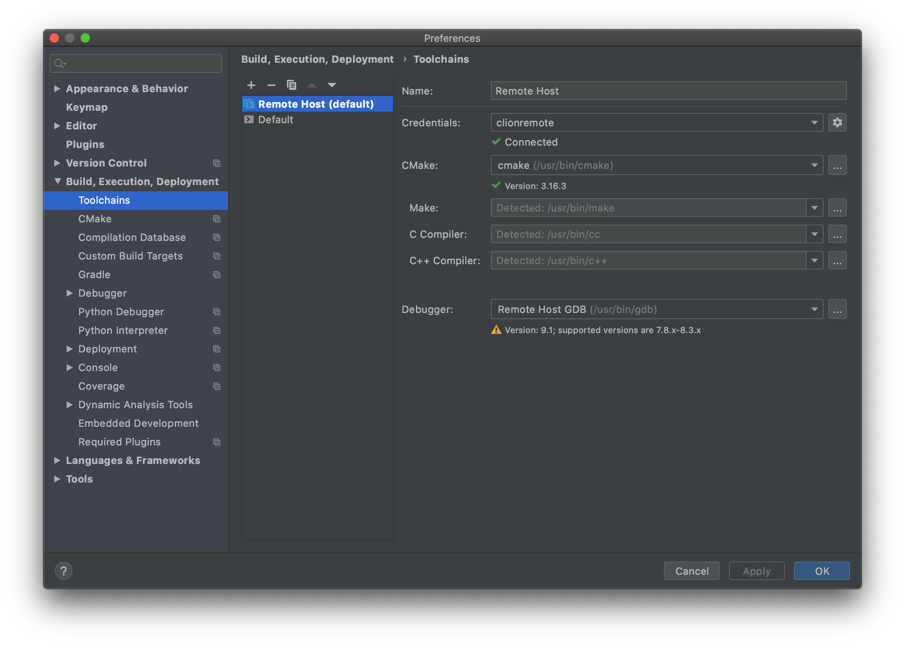
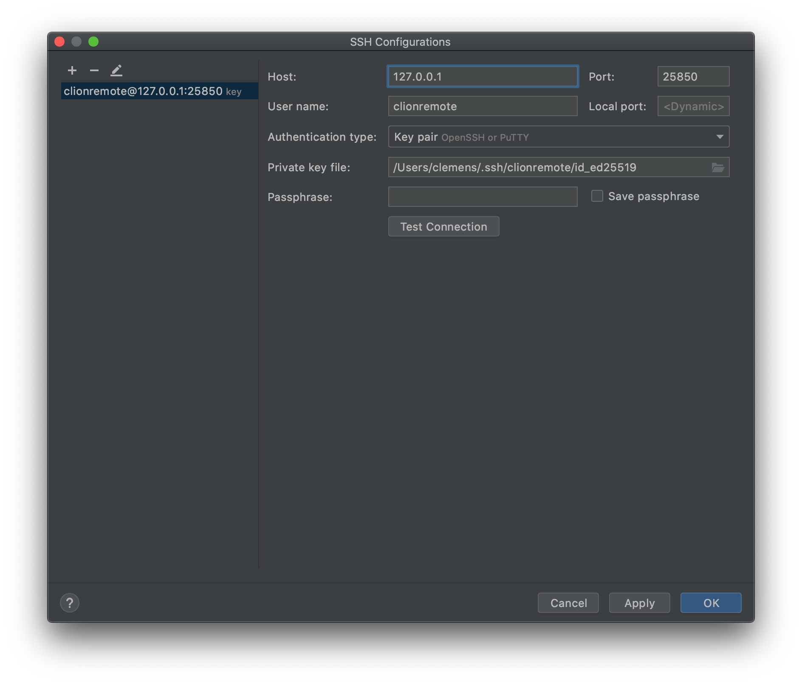

# Clion Remote Toolchain

## Installation Guide

#### Step 1: Clone this Repostory
```
git clone https://github.com/crumpfhuber/docker-clionremote.git
```

#### Step 2: Clone this Repository
```
https://github.com/crumpfhuber/docker-clionremote
```

#### Step 3: Create SSH Key in the same Directory as the Repository
```
ssh-keygen -t ed25519
```

#### Step 4: Build Docker Container
```
docker build -f ./Dockerfile -t crumpfhuber/clion-remote .
```

#### Step 5: Run Docker Container
```
docker run -d --name clion-remote --hostname="clion-remote" -p 25850:22 --restart=always -it crumpfhuber/clion-remote:latest
```

#### Step 6: Add Remote Host to Clion Toolchains



