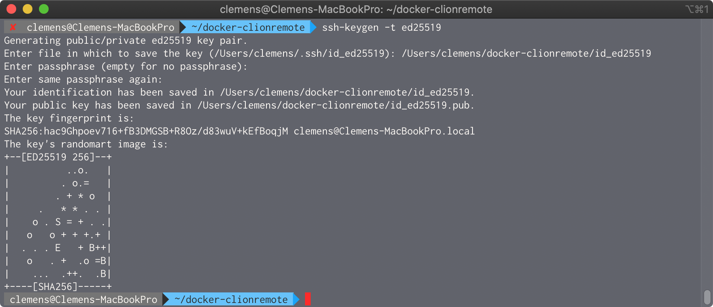

# Clion Remote Toolchain

## Installation Guide

#### Step 1: Clone or download this Repostory
```
git clone https://github.com/crumpfhuber/docker-clionremote.git
```

#### Step 2: Create SSH Key in the Repository Directory
```
ssh-keygen -t ed25519
```



#### Step 3: Build Docker Container
```
docker build -f ./Dockerfile -t crumpfhuber/clion-remote .
```

#### Step 4: Run Docker Container
```
docker run -d --name clion-remote --hostname="clion-remote" -p 25850:22 --restart=always -it crumpfhuber/clion-remote:latest
```

#### Step 5: Add Remote Host to Clion Toolchains


